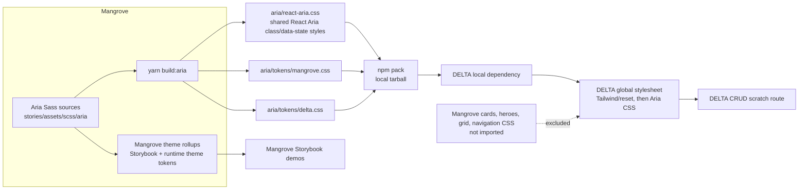

# React Aria and Mangrove integration spike

> This file is the decision record for the throwaway integration spike: what
> the separate token/style surface proves, its constraints, and the follow-up
> work required before production adoption.

## Result

This spike establishes a separate CSS distribution surface for React Aria Components:

- `@undrr/undrr-mangrove/tokens/mangrove.css`
- `@undrr/undrr-mangrove/tokens/delta.css`
- `@undrr/undrr-mangrove/aria.css`

## Draft PRs

- [Mangrove provider spike #1080](https://github.com/unisdr/undrr-mangrove/pull/1080)
- [DELTA consumer spike #686](https://github.com/PreventionWeb/delta/pull/686)

The distribution deliberately uses no custom CSS layers, and this is now a
settled decision rather than a spike expedient. DELTA has significant unlayered
legacy CSS, which outranks ordinary declarations inside a named layer, so a
layered Aria surface would lose to exactly the rules it needs to beat. The Aria
stylesheet therefore ships as ordinary author CSS and follows DELTA's existing
reset/global imports. A `@layer` regression test pins this in the compiled
output.

## Architecture proved by the spike

The Sass sources are authoritative. The CSS under `aria/` is generated and is
the intentionally small, browser-ready public surface a consuming application
imports. Storybook demonstrates Mangrove's normal theme rollup; it is not the
mechanism used by DELTA.

## Questions

1. **Token emission: yes.** Mangrove already emits palette, semantic colour,
   spacing, and form properties on `:root`. The spike adds the small font and
   component-semantic subset needed by these components as standalone files.
2. **Aria styling layer: yes.** `aria/react-aria.css` targets React Aria's
   default classes and data attributes. Every visual value resolves through a
   `--mg-aria-*` custom property; literals are confined to the two token files.
3. **Theme swap: yes.** The Aria stylesheet is identical for both token files.
   DELTA's file uses its existing navy (`rgb(19 46 72)`) and the shared
   Mangrove Arabic typography choice.
4. **Selective consumption: yes.** DELTA imports only the two CSS subpaths and
   imports React Aria Components directly. It does not import Mangrove's root
   export, so Mangrove's component stylesheet is not an input to its bundle.
5. **Distribution shape: yes.** `npm pack` created a local tarball, which was
   freshly packed and installed in DELTA from a local tarball. The installed
   package's explicit CSS exports resolved during `yarn build`.
6. **Cascade determinism: yes, by ordinary source order.** DELTA uses Tailwind
   4.2 alongside unlayered legacy CSS. A dedicated Aria layer was overridden by
   that legacy CSS, so the agreed shape is no custom layers at all: the Aria
   surface is ordinary author CSS and wins or loses on normal specificity and
   source order. Consumers control it by import position rather than by layer
   name. This is deliberate — adopting `@layer` would require DELTA's legacy CSS
   to be layered first, which is not planned.
7. **Overlay theming: yes.** The `Popover` targets the portalled React Aria
   overlay. Standalone adapter tokens are available on `:root`; Mangrove's
   runtime theme aliases are also emitted on the body theme classes so a
   portalled overlay inherits the active theme. Browser verification opened
   the portal, confirmed its token surface, and confirmed the DELTA trigger
   resolves to DELTA navy (`rgb(19, 46, 72)`).

## Expanded component evidence

The initial three-component scope was deliberately extended to probe the
table-heavy DELTA use case. The demos now also exercise:

- `Checkbox` for row selection and filter controls;
- `DateField`, `DateInput`, and `DateSegment` for segmented date entry;
- `Table`, sortable `Column`s, `ColumnResizer`, `TableBody`, `Row`, and
  `Cell`, including locally managed pagination and an empty state;
- `TagGroup` filters, a multi-select column chooser, and text search;
- `ToggleButton` favourites, row-selection checkboxes, and a responsive
  `GridList` alternative to the table;
- portalled `Menu`/`MenuItem` action menus, including a nested share submenu;
- `Dialog`/`Modal`, `DropZone`, `ComboBox`, `Select`, `DatePicker`, and
  `Calendar` in a functioning create/edit flow; and
- a confirmation dialog for deletion.

The Mangrove CRUD story now mirrors the interaction model of the React Aria example
using hazardous-event fixture data: search, filters, column visibility,
sorting, resizing, pagination, favourite toggles, row selection, action menu,
create, edit, delete, image drop/preview, date selection, and responsive list
view all update the story’s in-memory state. It deliberately has no network or
data-store implementation; that is outside this styling/distribution spike.
DELTA now mirrors the desktop CRUD proof with search, filters and clear state,
column visibility, sorting/resizing, multi-row selection, favourites, nested
row actions, pagination, and functioning create/edit/delete overlays including
validation, ComboBox, date picker, and image-drop handling.

The Mangrove stories also exercise the v2 experience-principle layer without
turning the spike into a wrapper library. React Aria controls now consume
theme-owned button, form, and surface geometry; raised surfaces use Mangrove's
semantic shadow tokens; controls have explicit focus, pressed, reduced-motion,
and forced-colour treatments; and the compact view composes the same data as a
responsive card list. The adapter aliases are repeated on runtime theme
classes so their dependent custom properties resolve in the active theme,
rather than being frozen to the `:root` defaults.

Two implementation details were useful findings rather than styling failures:

- Resizable columns require an explicit `ColumnResizer` in each column header.
  It must be positioned as a full-width header child, otherwise the handle
  appears beside the label rather than at the column boundary.
- A `Checkbox` rendered in a React Aria table's selection context must use
  `slot="selection"`; without it, React Aria rejects the render with a clear
  runtime error. This is a named-part composition requirement, not a Mangrove
  CSS limitation.
- A dynamic table body whose cells follow a user-controlled column set must
  receive that set as a stable `TableBody` `dependencies` value. Without it,
  React Aria can retain the old row-cell collection after a column is hidden,
  producing a cell-count error. Passing the `Set` itself keeps the dependency
  array's length stable while correctly invalidating the row cache.

## Evidence

- A fresh `npm pack` tarball installs into DELTA and `yarn tsc` plus
  `yarn build` succeed, creating an `aria-spike` client chunk.
- `yarn build` succeeds in Mangrove after the expanded CRUD editor and its
  theme-rollup imports were added.
- The emitted DELTA stylesheet contains no `.mg-button`, `.mg-card`,
  `.mg-hero`, `.mg-grid`, or `.mg-navigation` selectors. Its imports do not
  traverse Mangrove's root entry, which is the only entry that imports
  Mangrove's full component stylesheet.
- `npm pack` contains `aria/react-aria.css` and both token files.
- Manual repository-local Playwright checks confirmed the Select overlay,
  sortable columns, pagination, and token-styled controls in the DELTA and
  Storybook demos. Screenshots were intentionally removed from the package/PR
  rather than shipped as artifacts.
- The manual v2 visual and interaction audit covered Chromium and Firefox at
  desktop and mobile widths, keyboard-opened Select and dialog flows, modal
  focus containment, RTL layout, reduced motion, long fixture labels, and the
  Global UNDRR, MCR2030, and DELTA runtime themes. The compact story had no
  horizontal overflow, and the theme audit confirmed that MCR and DELTA retain
  their own colour and geometry rather than inheriting a homogenised default.

## Limitations and follow-up

The package now uses a `files` allow-list. The tarball dropped from 693 files
(3.60 MB unpacked, 1239 KB packed) to 374 files (1.71 MB unpacked, 714 KB
packed) by excluding stories, MDX and Storybook documentation, tests and
snapshots, and gitignored compiled CSS. Every file reachable from the root
export was verified to still ship, and all four export subpaths were resolved
from a freshly packed and extracted tarball. The Aria Sass source lives inside
Mangrove's Sass tree and participates in the normal theme rollup; the public
`aria/*.css` files are generated by `yarn build:aria` and explicitly mark
themselves as generated.

The public Aria stylesheet no longer carries spike-demo composition selectors.
Reusable React Aria primitive and state styles stay in
`stories/assets/scss/aria/_react-aria.scss`, which is the only input to
`yarn build:aria`; the `.aria-crud-*`, `.aria-integration-demo*` and
`.aria-spike-*` fixture styles moved to `_spike-demo.scss`, which is compiled
only through Mangrove's Storybook theme rollup. The split was verified lossless
by comparing all 372 selector/declaration pairs of the compiled output before
and after, and the boundary is now enforced by the token-contract suite.

The expanded table is a functioning in-memory spike, rather than a production
data form. Its create, edit, delete, filtering, sorting, and pagination state
is intentionally discarded on reload. It is not a public wrapper API and does
not claim a full component-system contract. A production implementation still
needs real data integration, validation rules from DELTA, translated product
copy, screen-reader testing, visual regression coverage, and error/loading
states. The spike-level browser checks reduce risk but are not a substitute for
product-specific accessibility and internationalisation acceptance testing.

## Effort estimate

- Production-ready foundation: 5–8 engineer days remaining (token contract,
  visual regression coverage, browser/a11y acceptance checks, and integration
  documentation). The package allow-list, the distributed-surface split, and
  the cascade decision are done.
- Full React Aria component set: 10–16 engineer weeks, depending on the number
  of component variants and required responsive/RTL states.

## Recommendation

**Proceed with React Aria.** The team has accepted the unlayered styling
surface, which was the one open condition. Distribution hygiene is now in
place: the shipped CSS carries only reusable primitives, and the tarball is
allow-listed. What remains before a broad rollout is product-level hardening —
visual regression coverage, screen-reader acceptance testing, translated copy,
and real data/error/loading states — not architectural work.
